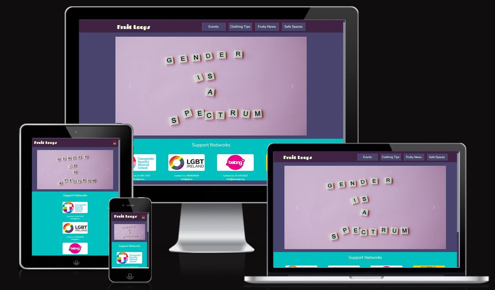
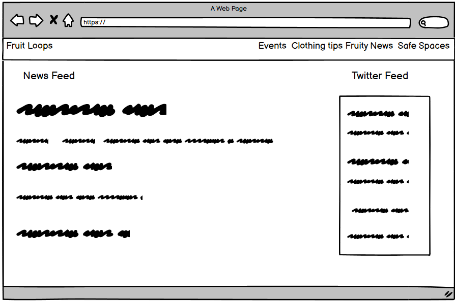
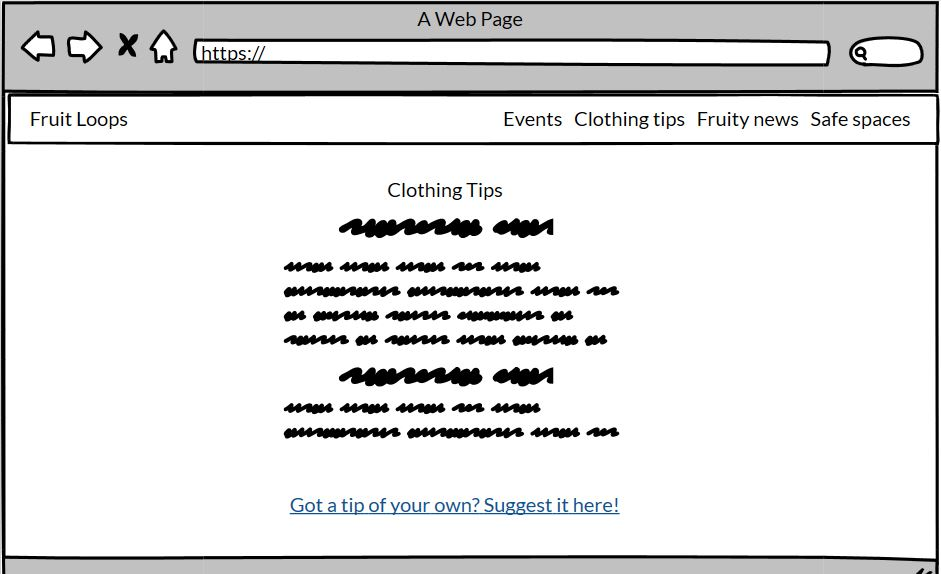
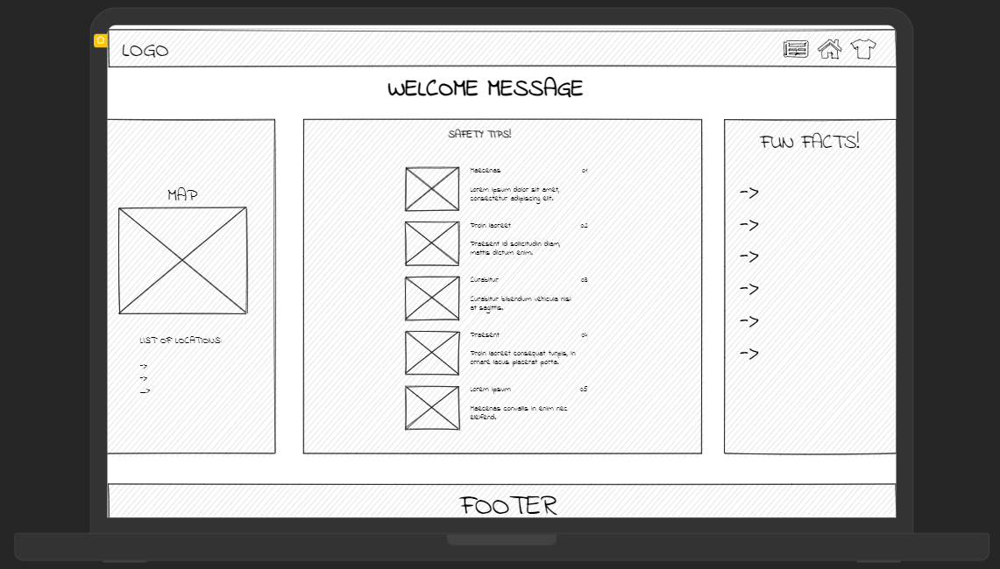
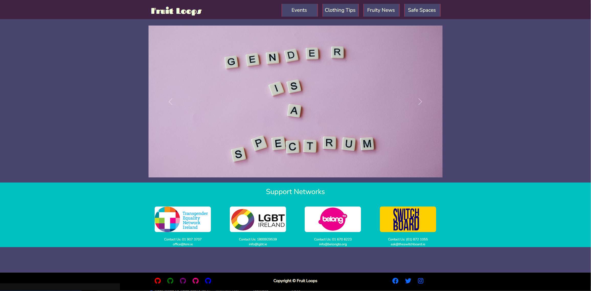
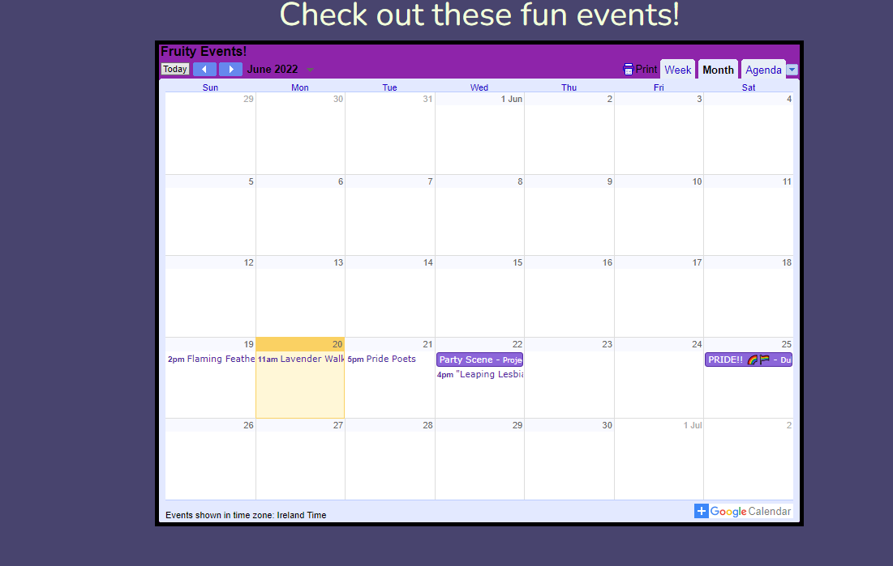
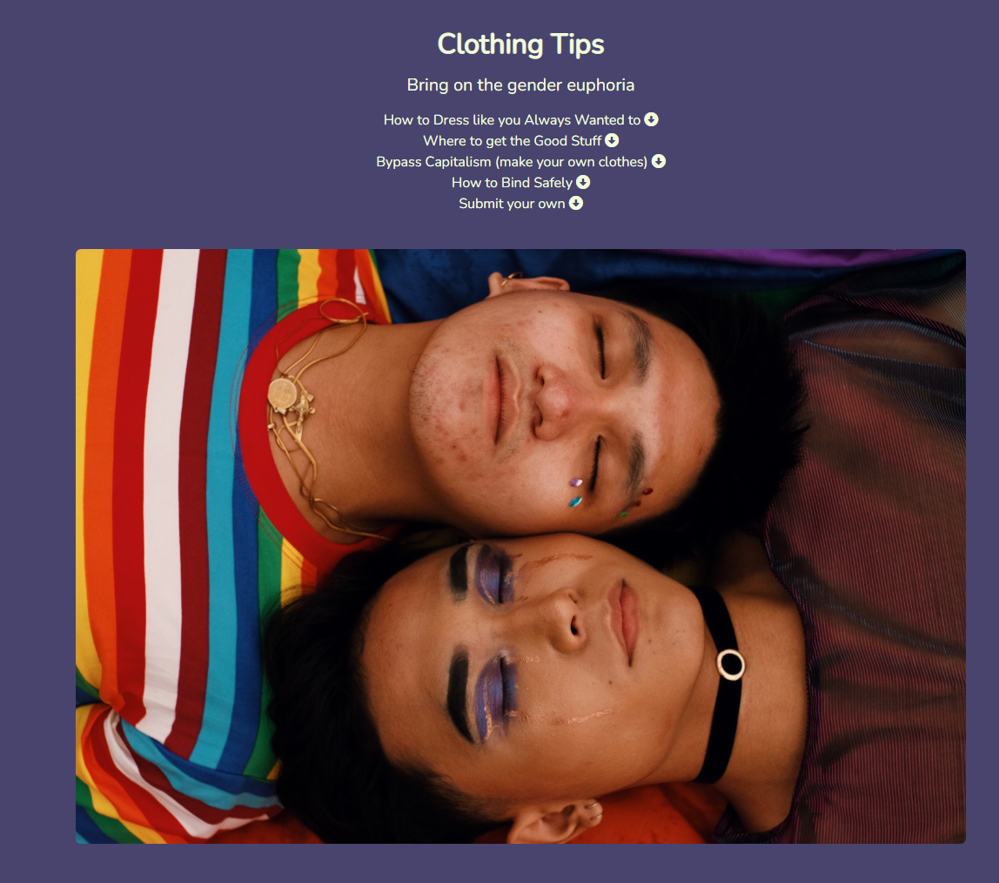
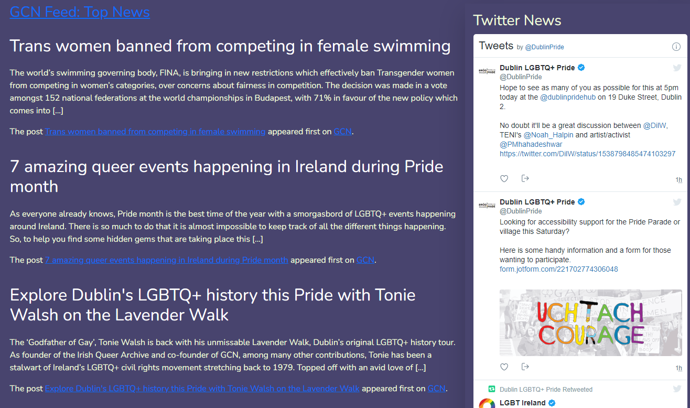
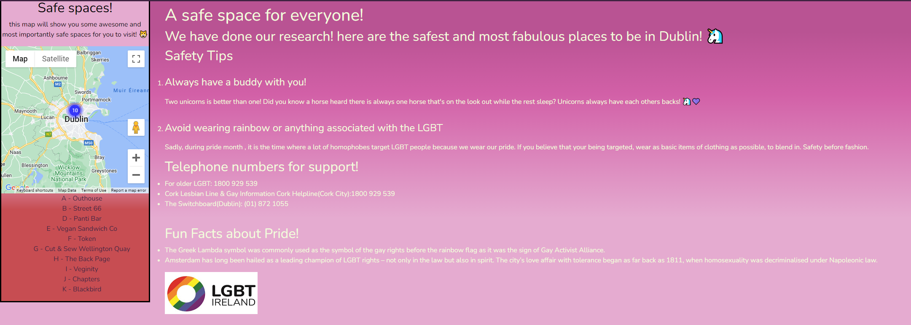

# Fruit-Loops

Fruit loops is a safe space with resources for the LGBTQ+ community. The site features a few different aspects of being LGBTQ+ to aid in day to day life. A main feature is clothings tips, this is for someone who needs advice or guidance into changing their wardrobe to reflect their personality. Here they can find up to date information from the community to give them relevent advice from trusted people. A safe space map is also available to show areas around Dublin that someone from the LGBTQ+ community would feel comfortable in. This helps to eleviate the tension of trying to find somewhere new and accepting. The site is a great hub for someone who is a part of the community or just coming to explore where they fit in the world. Fruit Loops is the hub designed for everyone online.

## UX

### User Stories

New Users

- As a New User I want to find available resources relating to the LGBTQ+ community
- As a New User I want to find local events and places which are accepting to the community
- As a New User I want to find clothing tips to give me guidance in my wardrobe choices
- As a New User I am looking for support systems that I can use when necessary.

Returning Users

- As a Returning User I want to see if there are any new events that I can attend
- As a Returning User I want to see if any new clothing tips have been approved for publishing
- As a Returning User I want to find a new safe space to visit

User stories have been managed across the github project board where we were able to track ongoing issues and relate them to the user story. This allowed us to correctly manage our time and prioritise specific tasks.

### Wireframes

Fruity News

Clothing Tips

Submit Clothing Tip

Safe Spaces

### Colours

We used [ColorSpace](https://mycolor.space/) for our site colour scheme and for the 'Back to top' button we used [Barchok's CSS pride flags](http://barchok.com/flags.html). We used:

For navigation elements (and anything else requiring a darker colour) - #402342
For backgrounds - #48446E
For text - #F2FEDC

## Features

### Home Screen

The site features a simple home screen with a welcoming carousel of images. There are three images that rotate between each other automatically. These are here to make the user feel safe and fully aware of the sites intent. Under that is a selection of support networks for the LGBT community with an available phone number and email adress. This fits the purpose of the site to be a safe space first and by providing support on the home screen users are getting the important info with ease. This reduces the need to go digging into the site and makes the user experience easier.

### Nav Bar

Across every page on the site is a functional Nav Bar that will allow the user to navigate with ease. It also features a static site logo in the left side that will bring the user home from anywhere on the site. We have made sure to include links to every section of the website so that everything is laid out with ease to the user.

### Events

The events page features a fully functional calendar that can connect to the users own personal calendar. It will display a selection of upcoming events from around the community. This was an important part of our available resources to ensure a user could find out what was going on at any point of the year. If a user finds an event that they want to take note of or potentially attend they can click the event for some controls. From here more info can be displayed, including the full location of the event and the duration. A user may also add this event to their own calendar without the need to create their own event using these controls. This again simplifies the process for the user.

### Clothing Tips

Clothings tips provides a selection of tips and available resources to anyone in the community. We were able to identify clothing as an area where a large percentage of the LGBT+ community would benefit from more information. Here different sections are laid out in their own content blocks and provide specific links to the user so they are not overwhelemed with information as soon as they load onto the page. Some Diy tips are encouraged as well as alternatives to buy online. A "Back to top" button is also seen in the bottom of the screen painted as a transgender pride flag. This again helps the user feel comfortable and reafirms that this is a safe space for the people who need it.

A feature is also available where the user can submit their own clothing tips. A form is included where the user can enter their tip to be submitted for review. The user can also attach their name and Email to be updated on if the tip was accepted for publishing. This encourages some community participation and ensures that all the information we display on the site has been provided from anyone who knows what they are talking about.

### Fruity News

Fruity news is the hub for latest information and community activity. This feed is targeted towards the LGBTQ+ community of Dublin and provides the user with only relevent topics to the community. On the left side of the page is a refreshing news feed providing a small sample of an article from the GNC. Here a user can find any posts that they can chose to read on a surface level or dive deeper to read a full article. All these links load into a new tab as expected rather than taking the user away from the site. On the right side is embeded stream of the Dublin LGBTQ+ Pride twitter page. This provides a more constant upstream of new content from around the community that is relevent to the user need.

### Safe Spaces

This section of the site is to provide further resources for anyone who needs it. A map is featured on the left side of the page that provides areas around Dublin that are marked as safe spaces. These are locations chosen because of their acceptance towards the community and give the user an easier time finding somewhere they can feel safe. We also provide general saftey rules for anyone who is perhaps worried or new to the community. Again we provide support numbers for ease of use, this reafirms the benefit to have one of these numbers saved in the unfortunate case that they are needed. There is also just a short message on the right to let the user know that all these locations from the map have been chosen because of their acceptance towards the community.

## Future Features

### Page Identity

One feature considered early in development was for each page to have its own identity, this would be done using different colour schemes to reflect different flags from the community. This felt like it would more personality to each section of the website. However it felt important to prioriitize functionality early on in the project and ensure that there would be the groundworks in place. 

### Chat Room

An idea to bring the community closer together was to include some form of chat room with user authentication. Users would be able to log in and chat in a reddit/chatroom style format. This would have required a toolset such as Django to get working the way we wanted, so decided early that we would not have the time to achieve this.

## Contributers

[Elyse Horan](https://github.com/ElyseRH)

[Josef Jakubiak](https://github.com/BritishBambi)

[Nikoletta Michailidou](https://github.com/nikolmichaelidou)

## Technologies

- HTML
    - This project uses HTML as the main language used to complete the structure of the Website.
- CSS
    - This project uses custom written CSS to style the Website.
- Javascript
    - Javascript was used to add dynamic features to the website.
- Google Cloud Platform
- Bootstrap
    - The project uses bootstrap for some custom styling elements to ensure responsive behaviour across devices.
- Git
- Github

## Deployment

- The site was deployed to GitHub pages. The steps to deploy were as follows: 
  - In the GitHub repository, navigated to the Settings tab 
  - From the source section drop-down menu, selected the Main Branch
  - Once the main branch has been selected, the page was automatically deployed. 

## Resources

[Dublin Pride](https://dublinpride.ie/events/) and [Meetup](https://www.meetup.com/) for events.

[https://gcn.ie/](https://gcn.ie/) for news.

[Dublin LGBTQ+ Pride](https://twitter.com/dublinpride) for twitter feed.

## Aknowledgments
